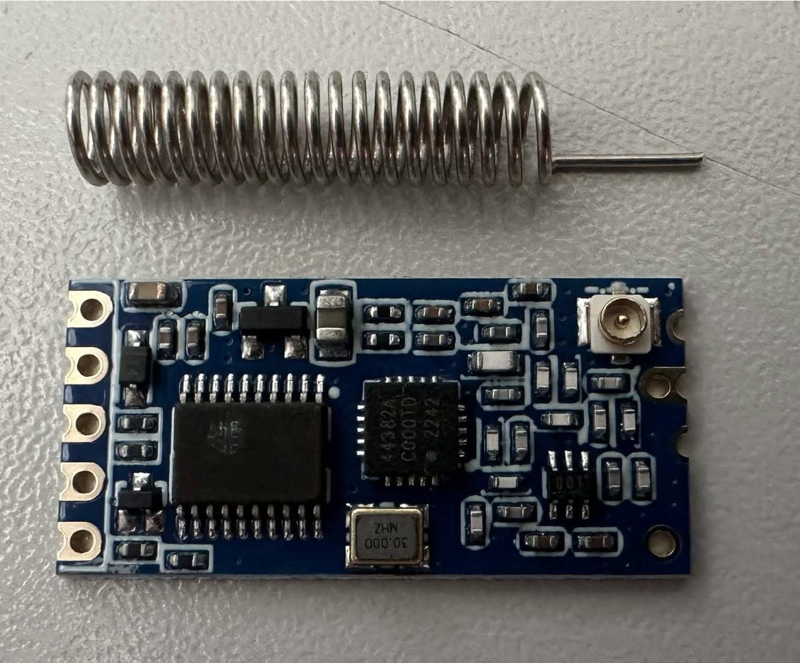
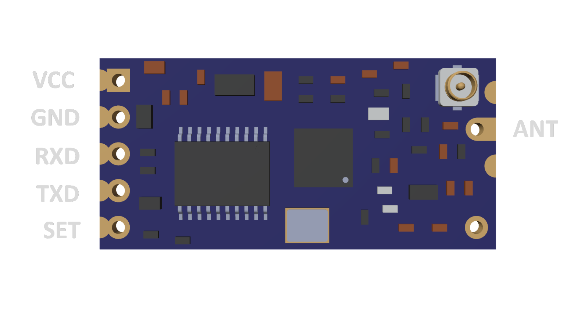
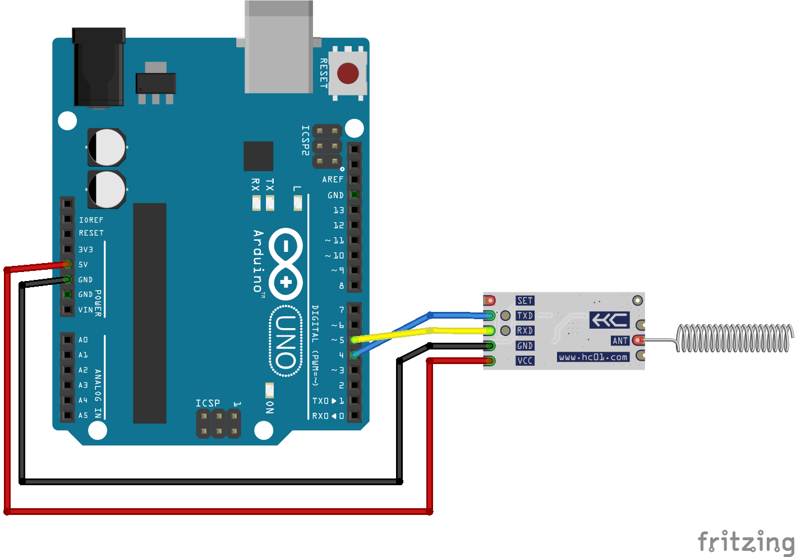
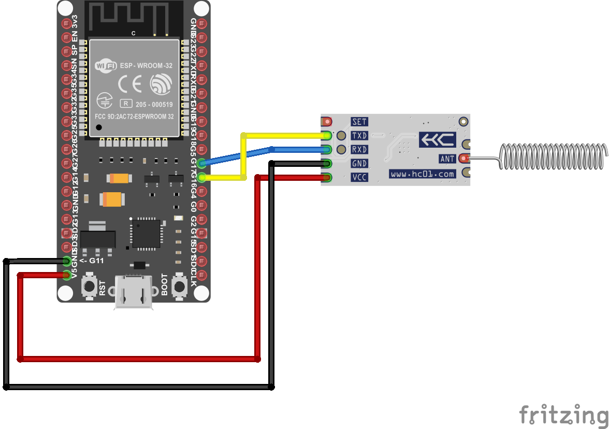

# HC-12 — Bezdrátový sériový modul 433 MHz

>Částečně vytvořeno pomocí AI (Claude sonnet 4.6) 

> HC-12 je bezdrátový modul, který funguje jako neviditelný sériový kabel.
> Vše co se pošle do jednoho modulu, přijde do druhého pomocí rádiových vln na frekvenci 433MHz. Modul nepoužívá Wi-Fi ani Bluetooth, to mu dovoluje komunikace na vzdálenosti až několik km.
 
---
 
## Obsah
 
- [HC-12 — Bezdrátový sériový modul 433 MHz](#hc-12--bezdrátový-sériový-modul-433-mhz)
  - [Obsah](#obsah)
  - [1. Úvod](#1-úvod)
    - [Více modulů v síti](#více-modulů-v-síti)
    - [Kdy se hodí HC-12?](#kdy-se-hodí-hc-12)
  - [2. Technické parametry](#2-technické-parametry)
  - [3. Popis desky a pinů](#3-popis-desky-a-pinů)
    - [Popis pinů](#popis-pinů)
    - [Co je uvnitř desky?](#co-je-uvnitř-desky)
  - [4. Provozní módy (FU1–FU4)](#4-provozní-módy-fu1fu4)
  - [5. AT příkazy, konfigurace](#5-at-příkazy-konfigurace)
    - [Přehled AT příkazů](#přehled-at-příkazů)
  - [6. Anténa](#6-anténa)
    - [Proč 1/4 vlnové délky?](#proč-14-vlnové-délky)
    - [Výpočet délky antény](#výpočet-délky-antény)
    - [Tipy pro anténu](#tipy-pro-anténu)
  - [7. Zapojení k mikrokontroléru](#7-zapojení-k-mikrokontroléru)
    - [Arduino](#arduino)
    - [ESP32 (3,3 V logika)](#esp32-33-v-logika)
  - [8. Ukázky kódu](#8-ukázky-kódu)
    - [Arduino — Vysílač](#arduino--vysílač)
    - [Arduino — Přijímač](#arduino--přijímač)
    - [MicroPython (ESP32) — Vysílač](#micropython-esp32--vysílač)
    - [MicroPython (ESP32) — Přijímač](#micropython-esp32--přijímač)
  - [9. Praktické aplikace](#9-praktické-aplikace)
  - [10. Bezpečnost a opatření](#10-bezpečnost-a-opatření)
  - [11. Zdroje](#11-zdroje)
---
 
## 1. Úvod
 

*Obr.1, HC-12 Tranciever a anténa*
 
HC-12 je **RF transceiver**, což znamená, že může posílat a přijímat data. Modul pracuje v pásmu 433 MHz rádiových vln.
Uvnitř obsahuje dva čipy a to rádiový transceiver Si4463 a mikrokontrolér STM8, který řídí veškerou RF komunikaci. Pro uživatele je ale celý tento systém neviditelný,
modul se chová jako obyčejná sériová linka (UART).

### Více modulů v síti
HC-12 podporuje komunikaci více modulů najednou to znamená že, všechny moduly na stejném kanálu 
a ve stejném módu se navzájem slyší. Jeden modul tak může vysílat zprávu a přijmout 
ji několik dalších zároveň. Protože ale modul nemá žádné adresování, všichni příjemci 
dostanou stejnou zprávu. Pokud je nutno rozlišit komu zpráva patří, musí se přidat 
adresa přímo do obsahu zprávy v kódu. Například jako první bajt každého paketu.
 
### Kdy se hodí HC-12?
- Pro propojení dvou mikrokontrolerů bezdrátově
- Dosah stovky metrů až kilometrů
- Jednoduché zapojení
- Relativně nízká latence
---
 
## 2. Technické parametry
 
| Parametr | Hodnota |
|---|---|
| Frekvenční pásmo | 433,4 – 473,0 MHz |
| Počet kanálů | 100 (rozestup 400 kHz) |
| Výkon vysílače | až **+20 dBm (100 mW)** |
| Citlivost přijímače | až −117 dBm (FU3), až −124 dBm (FU4) |
| Dosah | ~600 m (FU3), **~1,8 km (FU4)** |
| Napájení | 3,2 – 5,5 V |
| Odběr při vysílání | až 100 mA |
| Klidový odběr | 3,6 mA (FU1) / 80 µA (FU2) / 16 mA (FU3, FU4) / 22 µA (spánek) |
| UART baudrate | 1200 – 115 200 Bd |
| Rozměry | 27,8 × 14,4 × 4 mm |

*Tab.1, Parametry HC-12 [1]*

---
 
## 3. Popis desky a pinů
 

*Obr.2, Popis pinů*
 
### Popis pinů
 
| Pin | Název | Funkce |
|---|---|---|
| 1 | VCC | Napájení 3,2–5,5 V |
| 2 | GND | Zem |
| 3 | RXD | UART vstup (připojeno na TX mikrokontroléru) |
| 4 | TXD | UART výstup (připojeno na RX mikrokontroléru) |
| 5 | SET | LOW = konfigurace, HIGH = přenos dat |
| ANT1 | — | IPEX konektor pro externí anténu |
| ANT2 | — | Konektor pro pájení pružinové antény |

*Tab.2 , Popis pinů [1]*
 
Pin SET má interní pull-up 10 kΩ, takže dokud se nepřipojí nastavovací pin, modul automaticky běží v normálním (přenosovém) módu.
 
### Co je uvnitř desky?
 
- **Si4463 (Silicon Labs)** — RF čip, který přijímá a vysílá rádiový signál na 433 MHz [2]
- **STM8S003F3 (STMicroelectronics)** — 8bitový mikrokontrolér, který řídí Si4463 
  a zpracovává UART komunikaci [3]
- **RF přepínač µPG2214TB** — přepíná anténu mezi příjmem a vysíláním [4]
---
 
## 4. Provozní módy (FU1–FU4)
 
 
HC-12 má čtyři módy, které se liší spotřebou a dosahem.
**Oba moduly v páru musí mít nastavený stejný mód.** 
 
| Mód | Klidový odběr | Max. dosah | Latence | Kdy použít |
|---|---|---|---|---|
| FU1 | 3,6 mA | ~100 m | 15–25 ms | úspora energie, rychlá data |
| FU2 | 80 µA | ~100 m | ~500 ms | bateriové senzory, malé pakety |
| FU3 | 16 mA | ~600 m | 4–80 ms | výchozí, nejběžnější volba |
| FU4 | 16 mA | ~1,8 km | ~1 s | maximální dosah |

*Tab. 3, Provozní módy HC-12 [1]*
 
**FU3** automaticky přizpůsobuje vzduchový baudrate nastaveném UART baudrate:
čím pomalejší UART, tím citlivější přijímač a větší dosah.
 
**FU2** šetří energii tak, že modul spí a probouzí se jen pro příjem —
ale pakety nesmí být větší než 20 bajtů a odesílat je lze maximálně jednou za sekundu.
 
---
 
## 5. AT příkazy, konfigurace

 
AT příkazy jsou krátké textové příkazy pro konfiguraci modulu. Můžeme pomocí nich změnit baudrate nebo modul restartovat. [5]
 
**Jak vstoupit do konfiguračního módu:**
1. Pin SET musí být přivedený na GND
2. Komunikace přes UART vždy pouze  **9600** baudrate
3. Dále je možno dávat modulu AT příkazy
4. Po nahrání potřebných příkazů je nutno odpojit SET pin před posíláním dalších dat skrze HC-12
### Přehled AT příkazů
 
| Příkaz | Funkce | Příklad | Odpověď |
|---|---|---|---|
| `AT` | Test spojení | `AT` | `OK` |
| `AT+V` | Verze firmware | `AT+V` | `HC-12_V2.4` |
| `AT+Bxxxx` | Nastavení baudrate | `AT+B9600` | `OK+B9600` |
| `AT+Cxxx` | Nastavení kanálu (001–100) | `AT+C021` | `OK+C021` |
| `AT+FUx` | Nastavení módu | `AT+FU3` | `OK+FU3` |
| `AT+Px` | Nastavení výkonu (1–8) | `AT+P8` | `OK+P8` |
| `AT+RX` | Výpis nastavení | `AT+RX` | výpis |
| `AT+DEFAULT` | Tovární reset | `AT+DEFAULT` | `OK+DEFAULT` |
| `AT+SLEEP` | Uspání modulu (22 µA) | `AT+SLEEP` | `OK+SLEEP` |
 
*Tab. 4, Přehled AT příkazů HC-12 [1]*

---
 
## 6. Anténa 
 
 
Anténa výrazně ovlivňuje dosah. Přiložená pružinová anténa je kompaktní, ale přímý drát správné délky je efektivnější. Pro modul HC-12 se doporučuje anténa o délce jedné čtvrtiny vlnové délky.

### Proč 1/4 vlnové délky?

Anténa funguje nejlépe, když její délka odpovídá určitému podílu **vlnové délky**.
Délka $\frac{\lambda}{4}$ (čtvrtina vlnové délky) se používá proto, že:

- Vytváří v anténě **rezonanci** — stojatá vlna s nulou na konci, což maximalizuje vyzařování
- Minimalizuje **reaktanci** (imaginární složku impedance), takže se dosahuje optimálního přizpůsobení
- Prakticky se jedná o kompromis mezi účinností a rozměry antény

### Výpočet délky antény

Nejdřív vypočítáme **vlnovou délku** pomocí základního vztahu:

$$\lambda = \frac{c}{f}$$

kde:
- $c$ = rychlost světla = 300 000 000 m/s
- $f$ = frekvence v Hz

Pro HC-12 na **433 MHz** :

$$\lambda = \frac{300\,000\,000}{433\,000\,000} = 0{,}693 \text{ m} = 69{,}3 \text{ cm}$$

Čtvrtvlnná anténa má pak délku:

$$l = \frac{\lambda}{4} = \frac{69{,}3}{4} = 17{,}3 \text{ cm}$$

S **korekčním faktorem vodiče** (ideální teoretická anténa se v praxi chová trochu jinak, obvykle ~0,95): 

$$l_{\text{praktická}} = 17{,}3 \times 0{,}95 = \boxed{16{,}4 \text{ cm}}$$

### Tipy pro anténu

- Obě antény by měly být **vertikálně** (kolmo k zemi), jinak dosah klesá
- Anténa musí být vždy připojená **před zapnutím** modulu
- Přímý měděný drát o průměru 1–2 mm je efektivnější než pružinová anténa
- Anténu je dobré **chránit** před mechanickým poškozením a vlhkostí
---
 
## 7. Zapojení k mikrokontroléru

 
### Arduino 
 
```
Arduino D4  ←——  HC-12 TXD
Arduino D5  ——→  HC-12 RXD
---         ——→  HC-12 SET
Arduino 5V  ——→  HC-12 VCC
Arduino GND ——→  HC-12 GND
```


*Obr.3, Zapojení HC-12 k Arduino UNO*

### ESP32 (3,3 V logika)
 
```
ESP32 GPIO16 (UART2 RX)  ←——  HC-12 TXD
ESP32 GPIO17 (UART2 TX)  ——→  HC-12 RXD
---                      ——→  HC-12 SET
ESP32 VIN (5V)           ——→  HC-12 VCC
ESP32 GND                ——→  HC-12 GND
```
 


*Obr.4, Zapojení HC-12 k ESP32*

---
 
## 8. Ukázky kódu

HC-12 je velmi jednoduché na použití, chová se jako normální sériový port. Zde jsou minimální funkční příklady kódu.

### Arduino — Vysílač

Odešle text přes HC-12 každou sekundu.

```cpp
#include <SoftwareSerial.h>

SoftwareSerial HC12(4, 5);  // RX, TX

void setup() {
  HC12.begin(9600);
}

void loop() {
  HC12.println("Ahoj!");
  delay(1000);
}
```

### Arduino — Přijímač

Čeká na příchozí zprávy a vypisuje je.

```cpp
#include <SoftwareSerial.h>

SoftwareSerial HC12(4, 5);  // RX, TX

void setup() {
  Serial.begin(9600);
  HC12.begin(9600);
}

void loop() {
  if (HC12.available()) {
    Serial.println(HC12.readStringUntil('\n'));
  }
}
```

### MicroPython (ESP32) — Vysílač

Stejný princip, ale v Pythonu.

```python
from machine import UART, Pin
import time

hc12 = UART(2, baudrate=9600, tx=17, rx=16)

while True:
    hc12.write(b"Ahoj!\n")
    time.sleep(1)
```

### MicroPython (ESP32) — Přijímač

Přijímá a vypisuje zprávy.

```python
from machine import UART, Pin

hc12 = UART(2, baudrate=9600, tx=17, rx=16)

while True:
    if hc12.any():
        print(hc12.readline())
```

 Jeden přístroj posílá s `write()` nebo `println()`, druhý čeká na data s `available()` a čte je s `read()` nebo `readline()`. Baudrate musí být na obou stranách stejný.
 
---
 
## 9. Praktické aplikace
 
 
| Aplikace | Popis |
|---|---|
| **RC modely** | Přenos dat z ovladače do letadla/auta na stovky metrů |
| **Senzorové sítě** | Měření teploty, vlhkosti nebo hladiny vody v odlehlých místech |
| **Domácí automatizace** | Ovládání bran, světel nebo čerpadel bez Wi-Fi nebo kabelu |
| **Robotika** | Bezdrátové ovládání robota na větší vzdálenosti než dovolí WiFi/Bluetooth |
 
> HC-12 nemá šifrování ani adresování, pokud je potřeba, musí se doplnit v kódu.
 
---

## 10. Bezpečnost a opatření

**Legislativa (ČR)**
- Frekvence 433 MHz je v EU volně dostupná. 433 MHz patří do ISM (Industrial, Scientific, Medical) pásma v EU podle normy EN 300 220.
- HC-12 je rádiové zařízení. Modul by neměl by být provozován bez antény nebo s poškozenou anténou.
- Při instalaci je nutno dodržet minimální vzdálenost od metalických předmětů (alespoň několik cm)

**Elektromagnetická kompatibilita (EMC)**
- HC-12 emituje rádiové vlny a může rušit různá zařízení v blízkosti
  
**Bezpečnost v provozu**
- Rádiová komunikace není zabezpečena a libovolné přístroje na stejné frekvenci se slyší
- Pro bezpečné aplikace (jako RC modely) je doporučeno vytvořit autentizaci/checksum v kódu, což zajistí aby vždy došel celý packet.

---

## 11. Zdroje
 
[1] HC01.COM. *HC-12 Wireless Serial Port Communication Module — User Manual V2.6* [online].
[cit. 2026-05-22]. Dostupné z: <https://www.hc01.com/downloads/HC-12%20english%20datasheets.pdf>
 
[2] SILICON LABS. *Si4463/61/60 — EZRadioPRO Wireless IC Datasheet* [online].
[cit. 2026-05-22]. Dostupné z: <https://www.silabs.com/documents/public/data-sheets/Si4463-61-60-C.pdf>
 
[3] STMICROELECTRONICS. *STM8S003F3 — Value line, 8-bit MCU Datasheet* [online].
[cit. 2026-05-22]. Dostupné z: <https://www.st.com/resource/en/datasheet/stm8s003f3.pdf>
 
[4] DATA CAPTURE CONTROL. *HC-12 433MHz Wireless Transceiver Module — Pinout, Specs, Operation* [online].
[cit. 2026-05-22]. Dostupné z: <https://datacapturecontrol.com/articles/data-communication/wireless/rf/hc12/hc12-module>
 
[5] LUTZ, D. *Understanding and Implementing the HC-12 Wireless Transceiver Module* [online].
All About Circuits, 2017 [cit. 2026-05-22]. Dostupné z: <https://www.allaboutcircuits.com/projects/understanding-and-implementing-the-hc-12-wireless-transceiver-module/>
